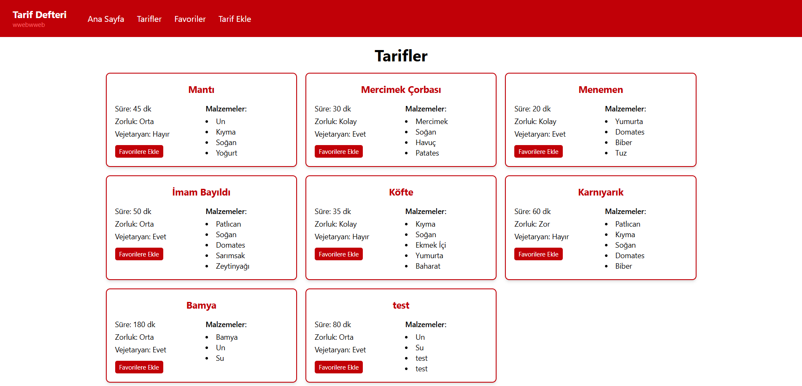

# Tarif Defteri

React ve TypeScript ile geliştirdiğim, kendi yemek tariflerimi listeleyip favorilere ekleyebildiğim, yeni tarif ekleyebildiğim bir tarif defteri uygulaması.

## Özellikler

- Tarifleri listeleme ve tek tek detay sayfasında görüntüleme
- Tarifleri favorilere ekleme/çıkarma (sayfa yenilense de kalıcı)
- Yeni tarif ekleme (form validasyonu ile)
- Mobil ve masaüstünde responsive tasarım

## Kullanılan Teknolojiler

- React + TypeScript
- Vite
- React Router
- TailwindCSS
- Context API (favoriler için global state)
- Custom hooks: `useFetch`, `useLocalStorage`

## Kurulum ve Çalıştırma

\`\`\`bash
npm install
npm run dev
\`\`\`

## Canlı Demo

https://kuzem-react-final-proje-wwebwweb.vercel.app/

## Ekran Görüntüsü

